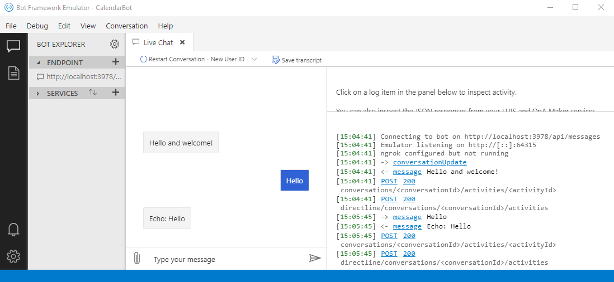

<!-- markdownlint-disable MD002 MD041 -->

В этом разделе описывается создание проекта Bot Framework.

1. Откройте интерфейс командной строки (CLI) в каталоге, в котором нужно создать проект. Выполните следующую команду, чтобы создать новый проект с помощью шаблона **Microsoft. Bot. Framework. CSharp. ечобот** .

    ```dotnetcli
    dotnet new echobot -n GraphCalendarBot
    ```

    > [!NOTE]
    > При получении `No templates matched the input template name: echobot.` сообщения об ошибке установите шаблон, выполнив приведенную ниже команду, и повторно выполните предыдущую команду.
    >
    > ```dotnetcli
    > dotnet new -i Microsoft.Bot.Framework.CSharp.EchoBot
    > ```

1. Переименуйте класс **ечобот** по умолчанию на **календарбот**. Откройте **./Ботс/ечобот.КС** и замените все экземпляры `EchoBot` на `CalendarBot` . Переименуйте файл в **CalendarBot.CS**.

1. Замените все экземпляры `EchoBot` `CalendarBot` в остальных **CS** файлы.

1. В интерфейсе командной строки смените текущий каталог на каталог **графкалендарбот** и выполните следующую команду, чтобы подтвердить построение проекта.

    ```dotnetcli
    dotnet build
    ```

## <a name="add-nuget-packages"></a>Добавление пакетов NuGet

Прежде чем переходить, установите некоторые дополнительные пакеты NuGet, которые будут использоваться позже.

- [Адаптивекардс](https://www.nuget.org/packages/AdaptiveCards/) , чтобы позволить роботу отправлять в ответах адаптивные карты.
- [Microsoft. Bot. Builder. Dialogs](https://www.nuget.org/packages/Microsoft.Bot.Builder.Dialogs/) для добавления поддержки диалоговых окон в Bot.
- [Microsoft. Распознаватели. Text. types. тимексекспрессион](https://www.nuget.org/packages/Microsoft.Recognizers.Text.DataTypes.TimexExpression/) для преобразования выражений Тимекс, возвращаемых из приглашений Bot, в объекты **DateTime** .
- [Microsoft. Graph](https://www.nuget.org/packages/Microsoft.Graph/) для совершения звонков в Microsoft Graph.

1. Выполните следующие команды в интерфейсе командной строки, чтобы установить зависимости.

    ```Shell
    dotnet add package AdaptiveCards --version 2.2.0
    dotnet add package Microsoft.Bot.Builder.Dialogs --version 4.10.3
    dotnet add package Microsoft.Bot.Builder.Integration.AspNet.Core --version 4.10.3
    dotnet add package Microsoft.Recognizers.Text.DataTypes.TimexExpression --version 1.4.1
    dotnet add package Microsoft.Graph --version 3.18.0
    ```

## <a name="test-the-bot"></a>Тестирование ленты

Перед добавлением кода проверьте, правильно ли он работает, и убедитесь, что эмулятор ленты настроен для тестирования.

1. Запустите Bot, выполнив следующую команду.

    ```dotnetcli
    dotnet run
    ```

    > [!TIP]
    > Несмотря на то, что для редактирования исходных файлов в проекте можно использовать любой текстовый редактор, рекомендуется использовать [Visual Studio Code](https://code.visualstudio.com/). Visual Studio Code предоставляет поддержку отладки, IntelliSense и многое другое. Если используется Visual Studio Code, программу Bot можно запустить с помощью меню **Run**  ->  **Отладка** запуска.

1. Подтвердите, что Bot работает, открыв браузер и перейдя в `http://localhost:3978` . Вы должны увидеть, что **ваш Bot готов!** Сообщение.

1. Откройте эмулятор Bot Framework. Выберите меню **файл** , а затем **откройте файл Bot**.

1. Введите `http://localhost:3978/api/messages` **URL-адрес Bot** и нажмите кнопку **подключить**.

1. Bot реагирует на то, что `Hello and welcome!` в окне чата. Отправьте сообщение на Bot и подтвердите его обратную отправку.

    
