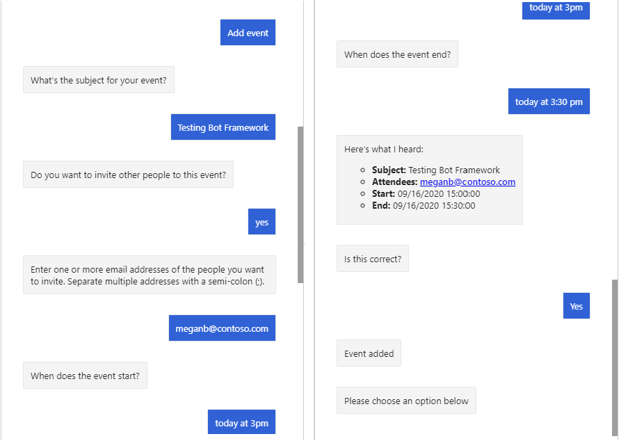

<!-- markdownlint-disable MD002 MD041 -->

<span data-ttu-id="09e0c-101">В этом разделе описывается добавление события в календарь пользователя с помощью пакета SDK Microsoft Graph.</span><span class="sxs-lookup"><span data-stu-id="09e0c-101">In this section you'll use the Microsoft Graph SDK to add an event to the user's calendar.</span></span>

## <a name="implement-a-dialog"></a><span data-ttu-id="09e0c-102">Реализация диалогового окна</span><span class="sxs-lookup"><span data-stu-id="09e0c-102">Implement a dialog</span></span>

<span data-ttu-id="09e0c-103">Сначала создайте новое настраиваемое диалоговое окно, в котором пользователю предлагается ввести значения, необходимые для добавления события в календарь.</span><span class="sxs-lookup"><span data-stu-id="09e0c-103">Start by creating a new custom dialog to prompt the user for the values needed to add an event to their calendar.</span></span> <span data-ttu-id="09e0c-104">В этом диалоговом окне будет использоваться **ватерфаллдиалог** для выполнения следующих действий.</span><span class="sxs-lookup"><span data-stu-id="09e0c-104">This dialog will use a **WaterfallDialog** to do the following steps.</span></span>

- <span data-ttu-id="09e0c-105">Запрос темы</span><span class="sxs-lookup"><span data-stu-id="09e0c-105">Prompt for a subject</span></span>
- <span data-ttu-id="09e0c-106">Спросите, хочет ли пользователь пригласить людей</span><span class="sxs-lookup"><span data-stu-id="09e0c-106">Ask if the user wants to invite people</span></span>
- <span data-ttu-id="09e0c-107">Запрашивать участников (если пользователь сказал "Да" на предыдущем шаге)</span><span class="sxs-lookup"><span data-stu-id="09e0c-107">Prompt for attendees (if user said yes to previous step)</span></span>
- <span data-ttu-id="09e0c-108">Запрашивать дату и время начала</span><span class="sxs-lookup"><span data-stu-id="09e0c-108">Prompt for a start date and time</span></span>
- <span data-ttu-id="09e0c-109">Запрашивать дату и время окончания</span><span class="sxs-lookup"><span data-stu-id="09e0c-109">Prompt for an end date and time</span></span>
- <span data-ttu-id="09e0c-110">Отображение всех собранных значений и попросите пользователя подтвердить</span><span class="sxs-lookup"><span data-stu-id="09e0c-110">Display all of the collected values and ask user to confirm</span></span>
- <span data-ttu-id="09e0c-111">Если пользователь подтверждает, получает маркер доступа из **оауспромпт**</span><span class="sxs-lookup"><span data-stu-id="09e0c-111">If user confirms, get access token from **OAuthPrompt**</span></span>
- <span data-ttu-id="09e0c-112">Создание события</span><span class="sxs-lookup"><span data-stu-id="09e0c-112">Create the event</span></span>

1. <span data-ttu-id="09e0c-113">Создайте новый файл в каталоге **./диалогс** с именем **NewEventDialog.CS** и добавьте следующий код.</span><span class="sxs-lookup"><span data-stu-id="09e0c-113">Create a new file in the **./Dialogs** directory named **NewEventDialog.cs** and add the following code.</span></span>

    ```csharp
    using System;
    using System.Collections.Generic;
    using System.Threading;
    using System.Threading.Tasks;
    using Microsoft.Bot.Builder;
    using Microsoft.Bot.Builder.Dialogs;
    using Microsoft.Bot.Schema;
    using Microsoft.Extensions.Configuration;
    using Microsoft.Extensions.Logging;
    using Microsoft.Graph;
    using CalendarBot.Graph;
    using Microsoft.Recognizers.Text.DataTypes.TimexExpression;
    using TimexTypes = Microsoft.Recognizers.Text.DataTypes.TimexExpression.Constants.TimexTypes;

    namespace CalendarBot.Dialogs
    {
        public class NewEventDialog : LogoutDialog
        {
            protected readonly ILogger _logger;
            private readonly IGraphClientService _graphClientService;

            public NewEventDialog(
                IConfiguration configuration,
                IGraphClientService graphClientService)
                : base(nameof(NewEventDialog), configuration["ConnectionName"])
            {

            }

            // Generate a DateTime from the list of
            // DateTimeResolutions provided by the DateTimePrompt
            private static DateTime GetDateTimeFromResolutions(IList<DateTimeResolution> resolutions)
            {
                var timex = new TimexProperty(resolutions[0].Timex);

                // Handle the "now" case
                if (timex.Now ?? false)
                {
                    return DateTime.Now;
                }

                // Otherwise generate a DateTime
                return TimexHelpers.DateFromTimex(timex);
            }
        }
    }
    ```

    <span data-ttu-id="09e0c-114">Это оболочка нового диалогового окна, в котором пользователю предлагается ввести значения, необходимые для добавления события в календарь.</span><span class="sxs-lookup"><span data-stu-id="09e0c-114">This is the shell of a new dialog that will prompt the user for the values needed to add an event to their calendar.</span></span>

1. <span data-ttu-id="09e0c-115">Добавьте указанную ниже функцию в класс **невевентдиалог** , чтобы запросить у пользователя тему.</span><span class="sxs-lookup"><span data-stu-id="09e0c-115">Add the following function to the **NewEventDialog** class to prompt the user for a subject.</span></span>

    :::code language="csharp" source="../demo/GraphCalendarBot/Dialogs/NewEventDialog.cs" id="PromptForSubjectSnippet":::

1. <span data-ttu-id="09e0c-116">Добавьте указанную ниже функцию в класс **невевентдиалог** , чтобы сохранить субъекта, который пользователь дал на предыдущем шаге, и спросите, хотите ли вы добавить участников.</span><span class="sxs-lookup"><span data-stu-id="09e0c-116">Add the following function to the **NewEventDialog** class to store the subject the user gave in the previous step, and to ask if they want to add attendees.</span></span>

    :::code language="csharp" source="../demo/GraphCalendarBot/Dialogs/NewEventDialog.cs" id="PromptForAddAttendeesSnippet":::

1. <span data-ttu-id="09e0c-117">Добавьте указанную ниже функцию в класс **невевентдиалог** , чтобы проверить ответ пользователя на предыдущий шаг и при необходимости запросить у пользователя список участников.</span><span class="sxs-lookup"><span data-stu-id="09e0c-117">Add the following function to the **NewEventDialog** class to check the user's response from the previous step and prompt the user for a list of attendees if needed.</span></span>

    :::code language="csharp" source="../demo/GraphCalendarBot/Dialogs/NewEventDialog.cs" id="PromptForAttendeesSnippet":::

1. <span data-ttu-id="09e0c-118">Добавьте указанную ниже функцию в класс **невевентдиалог** , чтобы сохранить список участников из предыдущего этапа (если он есть) и запросить у пользователя дату и время начала.</span><span class="sxs-lookup"><span data-stu-id="09e0c-118">Add the following function to the **NewEventDialog** class to store the list of attendees from the previous step (if present) and prompt the user for a start date and time.</span></span>

    :::code language="csharp" source="../demo/GraphCalendarBot/Dialogs/NewEventDialog.cs" id="PromptForStartSnippet":::

1. <span data-ttu-id="09e0c-119">Добавьте указанную ниже функцию в класс **невевентдиалог** , чтобы сохранить начальное значение из предыдущего действия, и запросите у пользователя дату и время окончания.</span><span class="sxs-lookup"><span data-stu-id="09e0c-119">Add the following function to the **NewEventDialog** class to store the start value from the previous step and prompt the user for an end date and time.</span></span>

    :::code language="csharp" source="../demo/GraphCalendarBot/Dialogs/NewEventDialog.cs" id="PromptForEndSnippet":::

1. <span data-ttu-id="09e0c-120">Добавьте указанную ниже функцию в класс **невевентдиалог** , чтобы сохранить конечное значение из предыдущего действия, и попросите пользователя подтвердить все входные данные.</span><span class="sxs-lookup"><span data-stu-id="09e0c-120">Add the following function to the **NewEventDialog** class to store the end value from the previous step and ask the user to confirm all of the inputs.</span></span>

    :::code language="csharp" source="../demo/GraphCalendarBot/Dialogs/NewEventDialog.cs" id="ConfirmNewEventSnippet":::

1. <span data-ttu-id="09e0c-121">Добавьте указанную ниже функцию в класс **невевентдиалог** , чтобы проверить ответ пользователя, полученный на предыдущем шаге.</span><span class="sxs-lookup"><span data-stu-id="09e0c-121">Add the following function to the **NewEventDialog** class to check the user's response from the previous step.</span></span> <span data-ttu-id="09e0c-122">Если пользователь подтверждает входные данные, используйте класс **оауспромпт** для получения маркера доступа.</span><span class="sxs-lookup"><span data-stu-id="09e0c-122">If the user confirms the inputs, use the **OAuthPrompt** class to get an access token.</span></span> <span data-ttu-id="09e0c-123">В противном случае завершите диалоговое окно.</span><span class="sxs-lookup"><span data-stu-id="09e0c-123">Otherwise, end the dialog.</span></span>

    :::code language="csharp" source="../demo/GraphCalendarBot/Dialogs/NewEventDialog.cs" id="GetTokenSnippet":::

1. <span data-ttu-id="09e0c-124">Добавьте указанную ниже функцию в класс **невевентдиалог** , чтобы использовать пакет SDK Microsoft Graph для создания нового события.</span><span class="sxs-lookup"><span data-stu-id="09e0c-124">Add the following function to the **NewEventDialog** class to use the Microsoft Graph SDK to create the new event.</span></span>

    :::code language="csharp" source="../demo/GraphCalendarBot/Dialogs/NewEventDialog.cs" id="AddEventSnippet":::

    <span data-ttu-id="09e0c-125">Рассмотрите, что делает этот код.</span><span class="sxs-lookup"><span data-stu-id="09e0c-125">Consider what this code does.</span></span>

    - <span data-ttu-id="09e0c-126">Он получает **MailboxSettings** пользователя для определения предпочтительного часового пояса пользователя.</span><span class="sxs-lookup"><span data-stu-id="09e0c-126">It gets the user's **MailboxSettings** to determine the user's preferred time zone.</span></span>
    - <span data-ttu-id="09e0c-127">Он создает объект **event** , используя значения, предоставленные пользователем.</span><span class="sxs-lookup"><span data-stu-id="09e0c-127">It creates an **Event** object using the values provided by the user.</span></span> <span data-ttu-id="09e0c-128">Обратите внимание, что свойства **Start** и **End** задаются с помощью часового пояса пользователя.</span><span class="sxs-lookup"><span data-stu-id="09e0c-128">Note that the **Start** and **End** properties are set with the user's time zone.</span></span>
    - <span data-ttu-id="09e0c-129">Он создает событие в календаре пользователя.</span><span class="sxs-lookup"><span data-stu-id="09e0c-129">It creates the event on the user's calendar.</span></span>

## <a name="add-validation"></a><span data-ttu-id="09e0c-130">Добавление проверки</span><span class="sxs-lookup"><span data-stu-id="09e0c-130">Add validation</span></span>

<span data-ttu-id="09e0c-131">Теперь добавьте проверку на входные данные пользователя, чтобы избежать ошибок при создании события с помощью Microsoft Graph.</span><span class="sxs-lookup"><span data-stu-id="09e0c-131">Now add validation to the user's input to avoid errors when creating the event with Microsoft Graph.</span></span> <span data-ttu-id="09e0c-132">Мы хотим убедиться, что:</span><span class="sxs-lookup"><span data-stu-id="09e0c-132">We want to make sure that:</span></span>

- <span data-ttu-id="09e0c-133">Если пользователь предоставляет список участников, это должен быть список допустимых адресов электронной почты, разделенных точкой с запятой.</span><span class="sxs-lookup"><span data-stu-id="09e0c-133">If the user gives an attendee list, it should be a semicolon-delimited list of valid email addresses.</span></span>
- <span data-ttu-id="09e0c-134">Дата и время начала должны быть действительными датой и временем.</span><span class="sxs-lookup"><span data-stu-id="09e0c-134">The start date/time should be a valid date and time.</span></span>
- <span data-ttu-id="09e0c-135">Дата и время окончания должны быть допустимыми датой и временем, а также должно быть позже начала.</span><span class="sxs-lookup"><span data-stu-id="09e0c-135">The end date/time should be a valid date and time, and should be later than the start.</span></span>

1. <span data-ttu-id="09e0c-136">Добавьте указанную ниже функцию в класс **невевентдиалог** , чтобы проверить запись пользователя для участников.</span><span class="sxs-lookup"><span data-stu-id="09e0c-136">Add the following function to the **NewEventDialog** class to validate the user's entry for attendees.</span></span>

    :::code language="csharp" source="../demo/GraphCalendarBot/Dialogs/NewEventDialog.cs" id="AttendeesValidatorSnippet":::

1. <span data-ttu-id="09e0c-137">Добавьте следующие функции в класс **невевентдиалог** , чтобы проверить запись пользователя на наличие даты и времени начала.</span><span class="sxs-lookup"><span data-stu-id="09e0c-137">Add the following functions to the **NewEventDialog** class to validate the user's entry for start date and time.</span></span>

    :::code language="csharp" source="../demo/GraphCalendarBot/Dialogs/NewEventDialog.cs" id="StartValidatorSnippet":::

1. <span data-ttu-id="09e0c-138">Добавьте указанную ниже функцию в класс **невевентдиалог** , чтобы проверить запись пользователя на наличие даты и времени окончания.</span><span class="sxs-lookup"><span data-stu-id="09e0c-138">Add the following function to the **NewEventDialog** class to validate the user's entry for end date and time.</span></span>

    :::code language="csharp" source="../demo/GraphCalendarBot/Dialogs/NewEventDialog.cs" id="EndValidatorSnippet":::

## <a name="add-steps-to-waterfalldialog"></a><span data-ttu-id="09e0c-139">Добавление шагов в Ватерфаллдиалог</span><span class="sxs-lookup"><span data-stu-id="09e0c-139">Add steps to WaterfallDialog</span></span>

<span data-ttu-id="09e0c-140">Теперь, когда у вас есть все действия в диалоговом окне, необходимо добавить их в **ватерфаллдиалог** в конструкторе, а затем добавить **невевентдиалог** в **маиндиалог**.</span><span class="sxs-lookup"><span data-stu-id="09e0c-140">Now that you have all of the "steps" for the dialog, the last step is to add them to a **WaterfallDialog** in the constructor, then add the **NewEventDialog** to the **MainDialog**.</span></span>

1. <span data-ttu-id="09e0c-141">Откройте конструктор **невевентдиалог** и добавьте в него следующий код.</span><span class="sxs-lookup"><span data-stu-id="09e0c-141">Locate the **NewEventDialog** constructor and add the following code to it.</span></span>

    :::code language="csharp" source="../demo/GraphCalendarBot/Dialogs/NewEventDialog.cs" id="ConstructorSnippet":::

    <span data-ttu-id="09e0c-142">При этом добавляются все используемые диалоговые окна и добавляются все функции, реализованные в качестве действий в **ватерфаллдиалог**.</span><span class="sxs-lookup"><span data-stu-id="09e0c-142">This adds all of the dialogs that are used, and adds all of the functions you implemented as steps in the **WaterfallDialog**.</span></span>

1. <span data-ttu-id="09e0c-143">Откройте **./диалогс/маиндиалог.КС** и добавьте в конструктор следующую строку.</span><span class="sxs-lookup"><span data-stu-id="09e0c-143">Open **./Dialogs/MainDialog.cs** and add the following line to the constructor.</span></span>

    ```csharp
    AddDialog(new NewEventDialog(configuration, graphClientService));
    ```

1. <span data-ttu-id="09e0c-144">Замените код внутри `else if (command.StartsWith("add event"))` блока на `ProcessStepAsync` приведенный ниже код.</span><span class="sxs-lookup"><span data-stu-id="09e0c-144">Replace the code inside the `else if (command.StartsWith("add event"))` block in `ProcessStepAsync` with the following.</span></span>

    :::code language="csharp" source="../demo/GraphCalendarBot/Dialogs/MainDialog.cs" id="AddEventSnippet" highlight="3":::

1. <span data-ttu-id="09e0c-145">Сохраните все изменения и перезапустите Bot.</span><span class="sxs-lookup"><span data-stu-id="09e0c-145">Save all of your changes and restart the bot.</span></span>

1. <span data-ttu-id="09e0c-146">С помощью эмулятора Bot Framework подключитесь к Bot и войдите в систему.</span><span class="sxs-lookup"><span data-stu-id="09e0c-146">Use the Bot Framework Emulator to connect to the bot and log in.</span></span> <span data-ttu-id="09e0c-147">Нажмите кнопку **Добавить событие** .</span><span class="sxs-lookup"><span data-stu-id="09e0c-147">Select the **Add event** button.</span></span>

1. <span data-ttu-id="09e0c-148">Ответьте на приглашения создать новое событие.</span><span class="sxs-lookup"><span data-stu-id="09e0c-148">Respond to the prompts to create a new event.</span></span> <span data-ttu-id="09e0c-149">Обратите внимание, что при запросе начальных и конечных значений можно использовать фразу "сегодня в 3PM" или "Now".</span><span class="sxs-lookup"><span data-stu-id="09e0c-149">Note that when prompted for start and end values, you can use phrases like "today at 3PM", or "now".</span></span>

    
